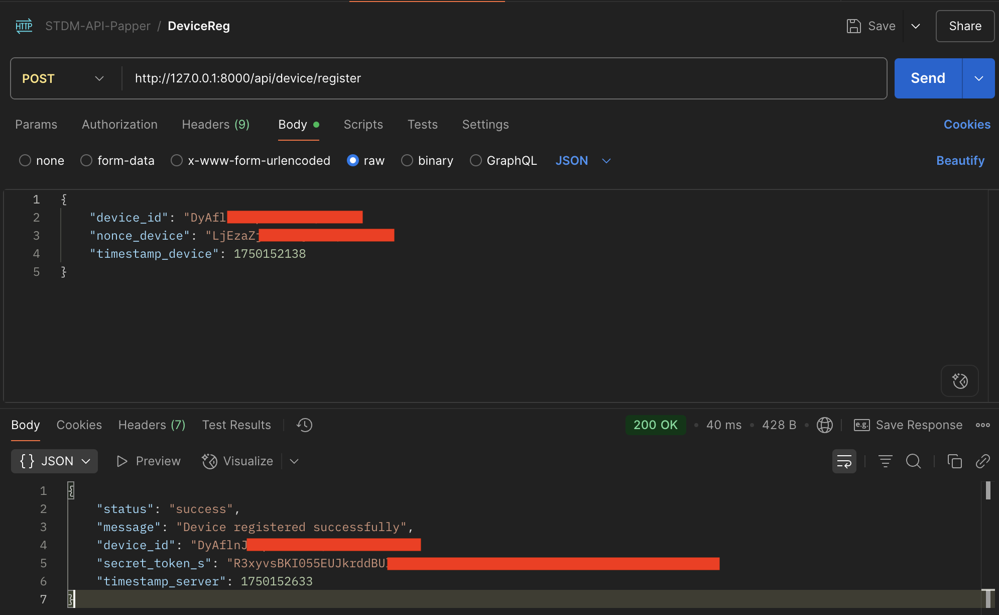
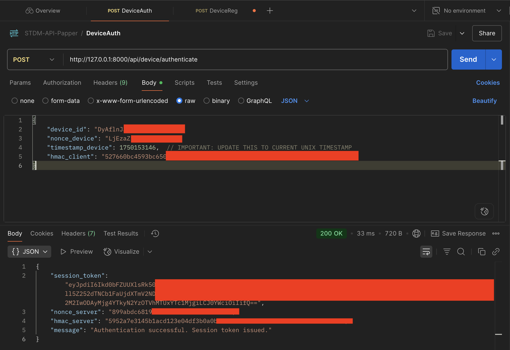
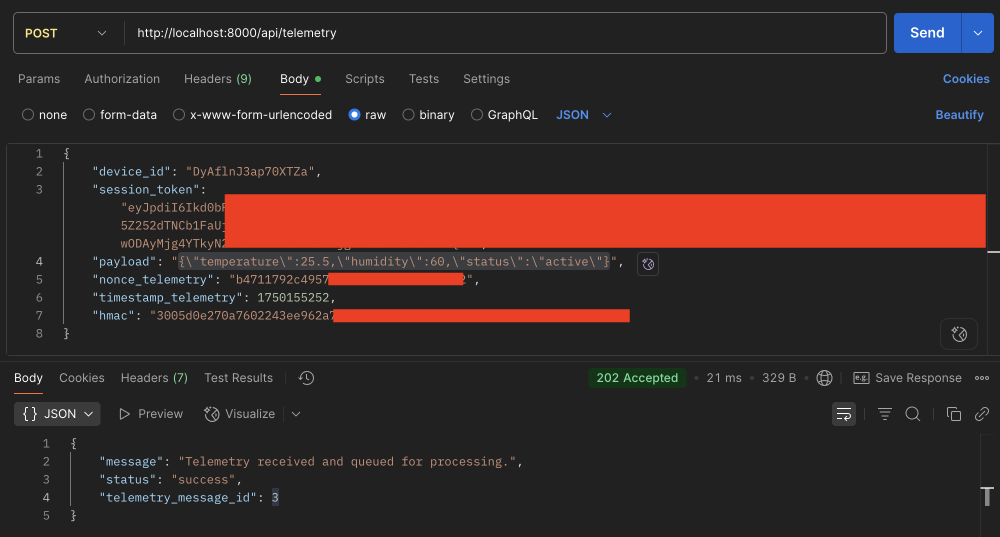

# Enabling Smart Traffic Decision-Decision-Making via RESTful APIs in 6G-based ITS Infrastructure

This repository contains the backend API implementation for a 6G-based Intelligent Transportation System (ITS) infrastructure, focusing on secure device communication and telemetry exchange. The project demonstrates a robust RESTful API built with Laravel, incorporating cryptographic measures for device registration, challenge-response authentication, and secure telemetry data transfer.

## Table of Contents

- [Features](#features)
- [Tools](#tools)
- [Implementation](#implementation)
- [Contributing](#contributing)
- [License](#license)

---

## Features

- **Secure Device Registration:** A cryptographic challenge-response mechanism for new devices to register with the API server.
- **Challenge-Response Authentication:** Devices authenticate with the server using a shared secret and dynamic nonces/timestamps to obtain a session token.
- **Secure Telemetry Exchange:** Encrypted and HMAC-protected exchange of telemetry data from registered devices, queued for asynchronous processing.
- **Laravel Framework:** Built on Laravel 12 for robust, scalable, and maintainable API development.
- **MySQL Database:** Utilizes MySQL for data persistence.
- **Queue System:** Asynchronous processing of telemetry messages using Laravel Queues (configured for database driver).

---

## Tools

- **PHP:** Version 8.3
- **Composer:** Latest stable version
- **Node.js & NPM:** Latest stable version
- **MySQL Server:** XAMPP Server
- **Git:** For cloning the repository.
- **Postman/Insomnia:** For testing the API endpoints.

---

## Implementation

Here are the screenshots demonstrating the API functionality and database state.

### Device Registration Success

### Authentication Success

### Telemetry Exchange Success

---
